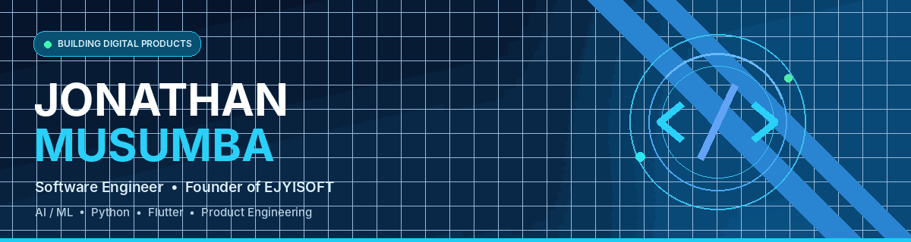

### Software Engineering Student · Product Builder · Founder of EJYISOFT

**Turning ideas into real-world digital products through software engineering and artificial intelligence.**

---

## 👨‍💻 About Me

I'm **Jonathan MUSUMBA**, a software engineering student, developer, and technology entrepreneur from the **Democratic Republic of the Congo**.

I'm the **Founder & CEO of [EJYISOFT](https://ejyisoft.tech)**, a technology company focused on building its own digital products, intelligent applications, and software solutions.

I enjoy working across the entire product lifecycle, from system architecture and backend development to mobile interfaces, AI models, testing, and deployment.

- 🎓 Studying **Software Engineering** at Université Protestante de Lubumbashi (UPL)
- 🚀 Founder & CEO of **EJYISOFT**
- 📱 Building mobile, web, and desktop applications
- 🧠 Exploring AI, machine learning, predictive systems, and conversational agents
- 🌍 Creating technology from the DR Congo with a global vision
- 🎵 Also interested in digital content creation and music technology

**My philosophy:** Build useful products, solve real problems, and keep improving.

---

## 🚀 What I'm Currently Working On

- ⚽ **BETAI:** Improving a published AI-assisted football analysis platform.
- 🛍️ **RDCDEAL:** Developing a marketplace designed for local buying and selling.
- 🏫 **GSchool:** Building school management software for administrative and financial operations.
- 🤖 **AI Research:** Exploring machine learning, intelligent agents, and automated movie dubbing.
- ⚙️ **Software Engineering:** Strengthening scalable architectures, API security, automated workflows, and production reliability.

---

## 🛠️ Technologies & Tools

### Languages

### Frameworks & Development

### Databases, Cloud & DevOps

### Artificial Intelligence & Automation

---

## 🌟 Featured Projects

### ⚽ BETAI — AI-Powered Football Analysis

**Status: Live — Android & Web**

BETAI is an intelligent football analysis platform developed by EJYISOFT.

It combines statistical data, machine learning models, and an interactive user experience to help football enthusiasts explore matches and predictions.

**Key capabilities:**
- AI-assisted football predictions and probabilities
- Match statistics and head-to-head analysis
- Betting market analysis and odds comparison
- AI-generated analysis coupons
- Prediction performance tracking
- Community features and social sharing
- Flutter mobile application

**Tech:** Flutter · Python · FastAPI · Machine Learning · Supabase · PostgreSQL

🌐 [Official Website](https://betai-app.com) · 📱 [Google Play](https://play.google.com/store/apps/details?id=com.ejyisoft.betai) · 💻 [Repository](https://github.com/EJYISOFT/BETAI)

*BETAI provides analytical information and does not guarantee sporting outcomes.*

### 🛍️ RDCDEAL — Digital Marketplace

**Status: In Development**

A mobile marketplace designed to connect buyers and sellers in the Democratic Republic of the Congo.

**Key capabilities being developed:**
- Product listings and local discovery
- Buyer and seller profiles
- Search, filters, and categories
- Listing promotion and verification features

**Tech:** Flutter · Supabase · Firebase

💻 [Repository](https://github.com/EJYISOFT/rdcdeal)

### 🏫 GSchool — School Management Software

**Status: Desktop Software**

A school management application developed by EJYISOFT to simplify administrative and financial operations.

**Key capabilities:**
- Student enrollment and records
- School fee and payment management
- Expense tracking and financial reporting
- PDF receipts and student cards
- Dashboard and administrative tools

**Tech:** Python · CustomTkinter · SQLite · Database Integration

💻 [Repository](https://github.com/EJYISOFT/Gschool)

### 🤖 UPLBOT — University Conversational Assistant

**Status: Functional Prototype**

An academic chatbot project designed to make university information more accessible through conversational AI.

The project explores natural language interaction, university knowledge bases, authenticated services, and human-agent escalation.

**Tech:** FastAPI · Google Gemini · Supabase · WebSocket · JavaScript

💻 [Repository](https://github.com/EJYISOFT/uplbot)

### 🎬 AI Movie Dubbing — Research & Development

**Status: Experimental**

A research initiative exploring automatic movie dubbing using artificial intelligence.

**Research areas:**
- Speech recognition and transcription
- Speaker identification
- Multilingual translation and adaptation
- Consistent synthetic voice generation
- Audio synchronization and reconstruction

**Tech:** Python · PyTorch · Whisper · Hugging Face · Audio Processing

💻 [Repository](https://github.com/EJYISOFT/ai-movie-dubbing)

### 💻 Other Work & Explorations

- **NEXORA:** Marketplace concept for the precious stones sector.
- **ATDI MANAGEMENT:** Custom management software developed for an NGO.
- **AfroSoul Lab:** Digital content creation and music-related projects.
- **Personal Portfolio:** [jomusumba.me](https://jomusumba.me)

---

## 📊 GitHub Activity

<b>📈 View Contribution Activity</b>

 

---

## 🎓 Courses & Certifications

- 🐍 Python — Udemy
- 🗄️ MySQL — Cursa
- 📝 Microsoft Word — Cursa
- 📱 Flutter — Cursa
- 💡 La tech c'est du concret — Trace+

---

## 🤝 Let's Connect & Collaborate

I'm interested in conversations and collaborations around software engineering, machine learning, mobile applications, AI automation, and technology entrepreneurship.

  

**Personal website:** [jomusumba.me](https://jomusumba.me)

**Company:** [EJYISOFT](https://ejyisoft.tech)

 

 

**Build with purpose. Innovate with discipline. Keep learning.**

Made with 💙 by Jonathan MUSUMBA

